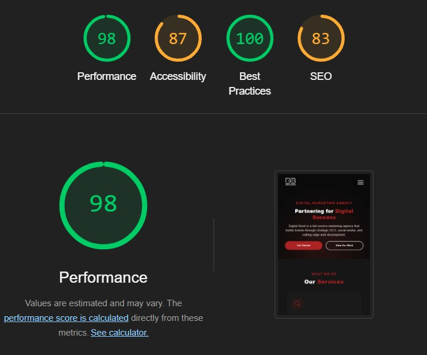

# DigitalBondTask

A high-performance, modern landing page built with Angular 20, leveraging the latest features like Zoneless Architecture, Signals, and SSR with Hydration.

## 🚀 Technical Highlights
- **Angular 20**: Utilizing the latest framework capabilities.
- **Zoneless Architecture**: Improved performance by removing `zone.js` dependency.
- **SSR & Hydration**: Full Server-Side Rendering for SEO and optimized Core Web Vitals (LCP).
- **Signals State Management**: Fully reactive form validation and UI logic.
- **Ultra-Wide Compatibility**: Content remains centered using a max-width container strategy, ensuring a premium look on all screen sizes.

## 🛠️ Project Setup & Configuration
The project was initialized with strict typing and server-side capabilities:
<pre>
           ng new digital-bond-task --ssr --strict
</pre>
   

 Why these flags?
  1) --ssr: Automatically integrates Angular Universal, setting up the Node.js Express server (server.ts) and server-side entry points.

  2) Built-in Hydration: Ensures the client-side app "wakes up" the server-rendered DOM instead of re-rendering, eliminating flickers.

  3) --strict: Enforces strict TypeScript rules for better code quality and fewer runtime bugs.
    
1. Initialization
The project was generated with:

- Standalone Components: To eliminate the overhead of NgModules and simplify the dependency tree.

- CSS: For advanced styling capabilities and variables.
  
2. Global Styles & Theming
A robust CSS variable system was implemented in styles.scss to manage the brand's color palette (--primary-color, --bg-dark, etc.) ensuring consistency and making future theme changes effortless.

## 🌐 SSR & Hydration Implementation
This project uses Angular Universal (SSR) to render pages on the server and SEO (Search Engine Optimization).

Implementation: Configured via provideServerRendering() in app.config.server.ts.

Hydration: Enabled using provideClientHydration() to ensure the client-side app picks up the server-rendered DOM without a full flicker/re-render, improving UX and Core Web Vitals.

## ⚡ Zoneless Architecture: The Deep Dive
This project is at the cutting edge by removing Zone.js. Traditionally, Angular relied on zone.js to "monkey-patch" browser APIs and detect changes. By going Zoneless, we gain more performance and smaller bundle sizes.

How it was applied:
1- Configuration: In app.config.ts, we replaced the default change detection with:

  provideExperimentalZonelessChangeDetection()
  
2- Signal-Based Reactivity: Since Zone.js is no longer watching every click or timer, we used Angular Signals to tell Angular exactly what has changed.

3- Reactive State: The contact form's validity.

4- Automatic Updates: Using computed() for form validation ensures that the UI only updates when the specific input signal changes, making the app incredibly efficient.

## 📝 Features & Validations
. Interactive Hero & Services: Fully responsive grid layouts.

. Custom CSS Carousel: Testimonials section with minimal JS for navigation.

. Advanced Contact Form:

   - Real-time Validation: Powered by Signals.

   - Name: Minimum 3 characters.

   - Email: Validated via Regex.

   - Message: Minimum 10 characters.

   - Logic: Form submission is disabled until all signals satisfy validation criteria.

   - Success Flow: Displays a Pop-up Modal and updates URL to /done upon successful submission.

<pre>

  ## 📂 Folders Structure
  The project follows a clean and modular directory structure as requested:
                src/
              └── app/
                  ├── components/         # Reusable UI components (Hero, Services, etc.) 
                  │   ├── navbar/
                  │   ├── hero-section/
                  │   ├── services-list/
                  │   ├── testimonials/
                  │   ├── contact-form/
                  │   └── footer/
                  ├── core/
                  |   |── models/         # Interfaces and Type definitions 
                  |        ├── client-data/
                  |        ├── contact-message/
                  |        ├── service-item/
                  ├── pages/           
                  │   └── homepage/
                  |   ├── sucuess/
                  ├── shared/
                  |   ├── service-card/
                  └── app.config.ts       # Zoneless & Hydration providers

</pre>
  ## 🚀 Getting Started
  To get a local copy up and running, follow these simple steps:

  Prerequisites
  1. Node.js: Latest LTS version.
  2. Angular CLI: ^20.0.0.

  Installation
  1.Clone the repository:
  
  <pre>
  git clone https://github.com/SSamoel/Digital-Bond-Task.git
  </pre>

  2.Install NPM packages:
     
  <pre>
    npm install 
  </pre>
  
  
  3.Start the application:

  <pre>
  ng serve
  </pre>

  4.Open your browser: Navigate to http://localhost:4200/

 ## 📊 Lighthouse Performance
  

  Live Demo: https://digital-bond-task.vercel.app/.
  Developed by: Sara Samoel | https://www.linkedin.com/in/sara-samoel-0abb7a233
  
      

